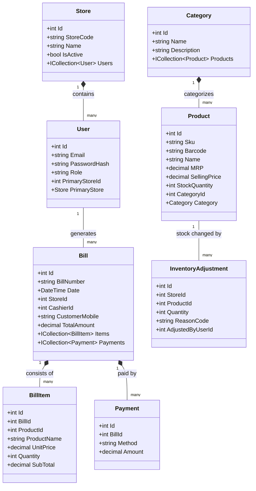

# Retail POS System - UML Class Diagram

This UML Class Diagram shows the core class structures and their relationships within the different microservices.

```mermaid
classDiagram
    class User {
        +int Id
        +string Email
        +string PasswordHash
        +string Role
        +int PrimaryStoreId
        +Store PrimaryStore
    }
    class Store {
        +int Id
        +string StoreCode
        +string Name
        +bool IsActive
        +ICollection~User~ Users
    }
    class Product {
        +int Id
        +string Sku
        +string Barcode
        +string Name
        +decimal MRP
        +decimal SellingPrice
        +int StockQuantity
        +int CategoryId
        +Category Category
    }
    class Category {
        +int Id
        +string Name
        +string Description
        +ICollection~Product~ Products
    }
    class Bill {
        +int Id
        +string BillNumber
        +DateTime Date
        +int StoreId
        +int CashierId
        +string CustomerMobile
        +decimal TotalAmount
        +ICollection~BillItem~ Items
        +ICollection~Payment~ Payments
    }
    class BillItem {
        +int Id
        +int BillId
        +int ProductId
        +string ProductName
        +decimal UnitPrice
        +int Quantity
        +decimal SubTotal
    }
    class Payment {
        +int Id
        +int BillId
        +string Method
        +decimal Amount
    }
    class InventoryAdjustment {
        +int Id
        +int StoreId
        +int ProductId
        +int Quantity
        +string ReasonCode
        +int AdjustedByUserId
    }

    Store "1" *-- "many" User : contains
    Category "1" *-- "many" Product : categorizes
    Bill "1" *-- "many" BillItem : consists of
    Bill "1" *-- "many" Payment : paid by
    User "1" -- "many" Bill : generates
    Product "1" -- "many" InventoryAdjustment : stock changed by
```
