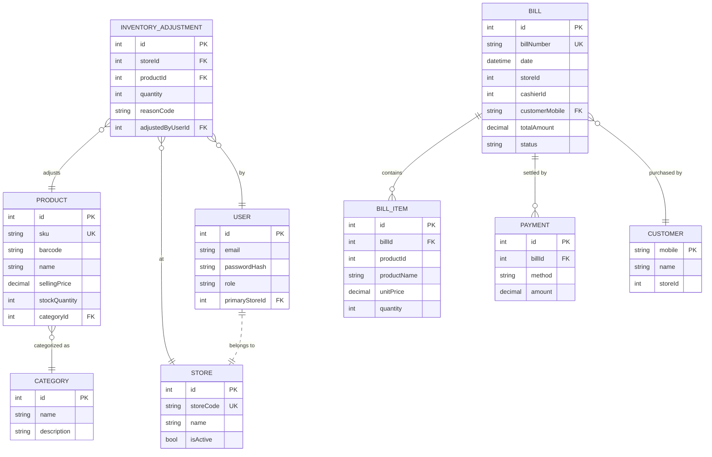

# Retail POS System - Database Entity Relationship Diagram

This diagram illustrates the data models and relationships across the microservices in the Retail POS system.

## Service Boundaries
*   **Identity Service**: Manages users, stores, and authentication.
*   **Catalog Service**: Manages the product catalog and categories.
*   **Orders Service**: Manages transactions, customers, and payments.
*   **Admin Service**: Manages inventory adjustments and dashboard analytics.
