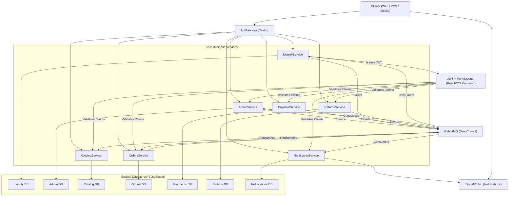

# RetailPOS High-Level Design (HLD)

```mermaid
flowchart TB
    U["Clients (Web / POS / Mobile)"]
    G["ApiGateway (Ocelot)"]

    subgraph Core["Core Business Services"]
        ID["IdentityService"]
        ADM["AdminService"]
        CAT["CatalogService"]
        ORD["OrdersService"]
        PAY["PaymentService"]
        RET["ReturnsService"]
        NOTI["NotificationService"]
    end

    subgraph Data["Service Datastores (SQL Server)"]
        IDDB["Identity DB"]
        ADMDB["Admin DB"]
        CATDB["Catalog DB"]
        ORDDB["Orders DB"]
        PAYDB["Payments DB"]
        RETDB["Returns DB"]
        NOTIDB["Notifications DB"]
    end

    MQ["RabbitMQ (MassTransit)"]
    AUTH["JWT + Permissions (RetailPOS.Common)"]
    HUB["SignalR Hub (Notifications)"]

    U --> G
    G --> ID
    G --> ADM
    G --> CAT
    G --> ORD
    G --> PAY
    G --> RET
    G --> NOTI

    ID --> IDDB
    ADM --> ADMDB
    CAT --> CATDB
    ORD --> ORDDB
    PAY --> PAYDB
    RET --> RETDB
    NOTI --> NOTIDB

    ID -- "Issues JWT" --> AUTH
    AUTH -- "Validates Claims" --> ADM
    AUTH -- "Validates Claims" --> CAT
    AUTH -- "Validates Claims" --> ORD
    AUTH -- "Validates Claims" --> PAY
    AUTH -- "Validates Claims" --> RET
    AUTH -- "Validates Claims" --> NOTI

    ADM -- "Events" --> MQ
    ID -- "Events" --> MQ
    ORD -- "Events" --> MQ
    PAY -- "Events" --> MQ
    RET -- "Events" --> MQ
    MQ -- "Consumers" --> ADM
    MQ -- "Consumers" --> ID
    MQ -- "Consumers" --> CAT
    MQ -- "Consumers" --> ORD
    MQ -- "Consumers" --> NOTI

    NOTI --> HUB
    U --> HUB
```
