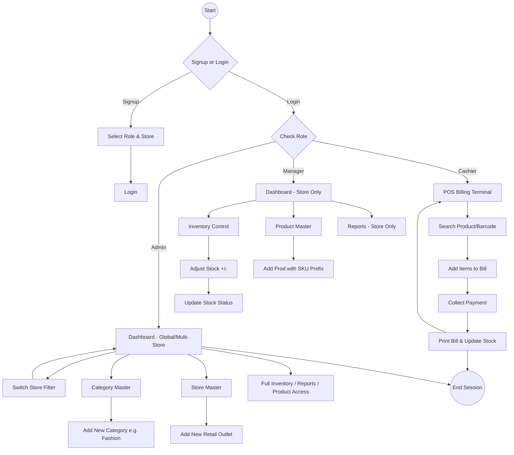

# Retail POS System - User Flow Chart

This flowchart describes the typical journeys for different users (Admin, Manager, Cashier) within the application.

```mermaid
graph TD
    Start((Start)) --> Signup{Signup or Login}
    Signup -- Signup --> RoleSelection[Select Role & Store]
    RoleSelection --> Login
    Signup -- Login --> AuthCheck{Check Role}

    %% Cashier Flow
    AuthCheck -- Cashier --> POS[POS Billing Terminal]
    POS --> Search[Search Product/Barcode]
    Search --> AddToCart[Add Items to Bill]
    AddToCart --> Payment[Collect Payment]
    Payment --> Finalize[Print Bill & Update Stock]
    Finalize --> POS

    %% Manager Flow
    AuthCheck -- Manager --> ManagerDash[Dashboard - Store Only]
    ManagerDash --> InventCntrl[Inventory Control]
    InventCntrl --> Adjust[Adjust Stock +/-]
    Adjust --> UpdateStatus[Update Stock Status]
    ManagerDash --> ProdMstr[Product Master]
    ProdMstr --> CreateProd[Add Prod with SKU Prefix]
    ManagerDash --> Reports[Reports - Store Only]

    %% Admin Flow
    AuthCheck -- Admin --> AdminDash[Dashboard - Global/Multi-Store]
    AdminDash --> StoreSelect[Switch Store Filter]
    StoreSelect --> AdminDash
    AdminDash --> CatMstr[Category Master]
    CatMstr --> AddCat[Add New Category e.g. Fashion]
    AdminDash --> StoreMstr[Store Master]
    StoreMstr --> AddStore[Add New Retail Outlet]
    AdminDash --> AllAccess[Full Inventory / Reports / Product Access]

    Finalize --> End((End Session))
    AdminDash --> End
```
